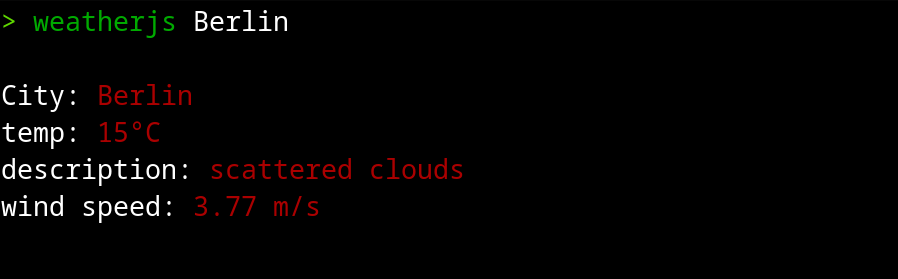
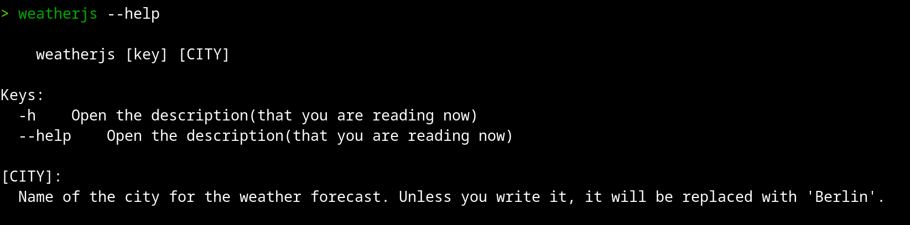

# Linux Weather JS

version 1.1 pre-alpha

---

## Description

It is the script you can add to your linux for watching weather right in your terminal with one command.

## There are two versions:

---

### MinNodeWeather.js

work:



```
// input
> weatherjs Berlin

// output
City: Berlin
temp: 15°C
description: scattered clouds
wind speed: 3.77 m/s

```

help:



```
// input
> weatherjs --help

// output

    weatherjs [key] [CITY]

Keys:
  -h    Open the description(that you are reading now)
  --help    Open the description(that you are reading now)

[CITY]:
  Name of the city for the weather forecast. Unless you write it, it will be replaced with 'Berlin'.

```

### nodeWeather.js

\*_it is still in development_

## How to install it

---

Both of versions installs the same way. **Here is an example about minNodeWeather.js script:**

Go `scripts/
