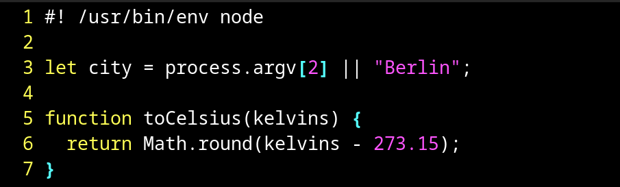

# Linux Weather JS

version 1.1 pre-alpha

---

## Description

It is the script you can add to your linux for watching weather right in your terminal with one command.

## There are two versions:

---

### MinNodeWeather.js

work:


```
// input
> weatherjs Berlin

// output
City: Berlin
temp: 15°C
description: scattered clouds
wind speed: 3.77 m/s

```

help:


```
// input
> weatherjs --help

// output

    weatherjs [key] [CITY]

Keys:
  -h    Open the description(that you are reading now)
  --help    Open the description(that you are reading now)

[CITY]:
  Name of the city for the weather forecast. Unless you write it, it will be replaced with 'Berlin'.

```

### nodeWeather.js

\*_it is still in development_

## How to install it

---

Both of versions installs the same way. **Here is an example about minNodeWeather.js script:**

First of all check if you have _Node.js_ at all:

```bash
which node
```

If nothing happend after this command, or there is an error, watch the _Node.js_ installation below.

```Bash
// choose your package manager

sudo apt-get install node
sudo dnf install node
sudo pacman -C node

```

Then, unless you've done it before, make a directory, where you will keep this script. For example `~/scripts`:

```Bash
mkdir ~/scripts
cd ~/scripts
```

Then, if _Node.js_ is installed, use this command, to copy a script into the directory:

```Bash
curl -o ~/scripts/minNodeWeather.js https://raw.githubusercontent.com/jestemczyk/linuxWeatherJs/master/scripts/minNodeWeather.js
```

And change the rights, to have the possibility to use it:

```Bash
chmod +x minNodeWeather.js
```

And you can use it already! But it's beter to make an `alias` for working with script with one command.

```bash
echo "alias weatherjs='node ~/scripts/minNodeWeather.js'" >> ~/.bashrc

source ~/.bashrc
```

If you use for example **zsh**, so change `.bashrc` on `.zshrc` in the command.

And now you can use it just by typing `weatherjs` command.

## How to use

---

If you installed it with the method from this docs, you can type

```Bash
weatherjs -h
// OR
weatherjs --help
```

to have information about how to use it.


You need to type `weatherjs [CITY]`, where [CITY] is the name of the city you need to know the current weather in. Unless you type the [CITY] option, it'll be replaced with 'Berlin'. If you want, you can change the default city with your own in the script yourself.

**To change the default city**, you need to open the script code with some text redactor, for example `vim`:

```Bash
vim minNodeWeather.js
```

Then, in the line 3 after `||` Change `'Berlin'` on the city you need.


